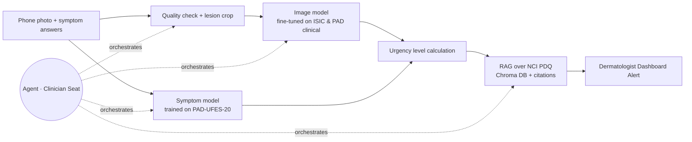

# Project Charter · Skin Lesion Triage for Healthcare Providers

**Team:** Ifat Davidson · Tami Khazma · Roi Budnitsky · Yuval Rubenchuk | **Course:** BIU DS23 Capstone | **Date:** 25.9.2026
**Retrieval asset:** the module 5 grounded assistant.

## 1 · Problem & User
**User:** A dermatologist working within an Israeli healthcare fund (e.g., Clalit, Maccabi) who manages an overloaded appointment queue, alongside a patient who captures a photo of a worrying mole using their smartphone.

**Pain:** A public-system dermatologist appointment in Israel takes a median of **24.5 days**, rising by **8.5 days a year**, and reaches **40–42 days** in Tel Aviv and Jerusalem. Patients often delay visits because they assume a spot "is probably nothing," causing rare, malignant lesions to be caught late. Meanwhile, dermatologists spend significant time examining benign lesions due to a lack of an efficient preliminary filtering mechanism.

**What we build:** The patient uploads a smartphone photograph of the lesion and fills out a brief symptom form via the healthcare fund's app. This data is **forwarded directly to a dermatologist's triage dashboard**. The AI analyzes the inputs to calculate a **preliminary risk score and flags high-urgency cases**, allowing the dermatologist to review the image remotely and fast-track urgent appointments (e.g., within 48 hours) or initiate immediate clinical workflows. This optimizes the queue system without rendering an autonomous, final diagnosis to the patient.
  
**AI-deletion test:** Without AI, the dermatologist's dashboard receives an unstructured, un-prioritized backlog of photos, forcing them to review images chronologically. This completely defeats the purpose of an automated urgency-based queue acceleration.

## 2 · Success metrics (fixed before any code)

| # | Metric | Target |
|---|---|---|
| M1 | **Sensitivity for skin cancer** (MEL + BCC + SCC → flagged for high-urgency dashboard triage) on **held-out PAD-UFES-20 patients** (real phone photos) | **≥ 0.90** |
| M2 | Specificity at the M1 threshold (proxy for reducing unnecessary clinician triage alerts) | ≥ 0.50 |
| M3 | Groundedness on a frozen set of 20 guidance questions (5 unanswerable), plus a check that each number appears in its cited source | ≥ 0.9, and 5/5 refusals |
| M4 | Agent scenario set of 15 complex clinical workflows | ≥ 13/15 correct; **zero** malignant cases left untriaged in the standard queue |

M1 takes strict precedence over M2: a missed melanoma has catastrophic clinical consequences compared to a false positive triage flag. To ensure diagnostic equity and mitigate systemic bias, all metrics will be stratified and reported across both distinct skin tones (utilizing the DDI dataset) and patient age groups.

## 3 · Data (all four checks passed, 18–19.9)
| Source | Role | Size | Layout / Image Type | Skin Tone Bias Mitigation |
|---|---|---|---|---|
| **PAD-UFES-20** | Main training & testing data | 2,298 images, 1,373 patients, 52 melanomas | **Smartphone (Clinical)** close-ups; includes rich patient metadata (age, sex, itch, bleed, history) | Includes diverse, multi-ethnic patient samples from Brazil. |
| **DDI (Diverse Dermatology Images)** | Skin-tone validation and bias test set | 656 images | **Smartphone & Clinical** images with verified biopsy gold standards | **Crucial MVP Addition:** Perfectly balanced across Fitzpatrick skin tones (I-VI) to test and prevent algorithmic bias on dark skin. |
| **ISIC Archive** (Clinical subsets) | Supplementary training | 8,837 images, 522 melanomas | Filtered explicitly for **Clinical/Macro images** (excluding dermoscopic) | Primarily light skin tones; used strictly for structural feature extraction. |
| **NCI PDQ** patient summaries | Guidance corpus for RAG | ~10–20 documents | Clinical text reference | N/A |

**Rejected:** 
- `HAM10000` & `BCN20000`: Completely dermoscopic. Since our MVP relies on patient-shot smartphone photos, dermoscopic data introduces an unacceptable domain gap.
- `marmal88/skin_cancer`: High data leakage (80% of its test set is present in the training set).
- `Fitzpatrick 17k`: More than 75% of the original image URLs are dead.
  
## 4 · Architecture

The system runs end-to-end as a multi-modal pipeline, utilizing an orchestrating agent to manage quality checks and contextual delivery to the clinician.

### Baseline Evaluation Table
To justify the multi-modal design, the pipeline will be benchmarked against the following baselines (evaluated strictly on the same held-out PAD-UFES-20 test patients):
1. **Metadata Only (The Floor):** A standard Logistic Regression model trained purely on patient age, sex, and the symptom checklist. *The baseline bar to beat is an AUC of 0.90 established during Exploratory Data Analysis (EDA).*
2. **Image Model Alone:** The vision component evaluated independently (fine-tuned on clinical images) to isolate the predictive power of visual features.
3. **The Selected Integrated MVP System (Multi-modal):** The full pipeline combining the Image Model + Symptom Model + RAG clinical explanation, routed directly into the Dermatologist Dashboard.

## 5 · Agent seat
- **Decision (what a script can't do):** for each referral, decide whether the photo is usable or the doctor must retake it, which missing clinical facts to request (a change over time matters for melanoma; bleeding points to BCC), which similar cases and guideline passages support the priority, and when uncertainty should raise the case rather than lower it.
- **Tools:** `check_image_quality`, `score_lesion`, `find_similar_cases`, `request_info_from_referrer`, `retrieve_guidance`, `write_triage_note`.
- **On failure:** fall back to ranking by model score only. Any error or low confidence moves the case **up** the queue, never down.
- **Guardrails:**
  - never closes or dismisses a referral;
  - never states a diagnosis, only a priority with cited reasons;
  - "I don't know" outside the guidance corpus;
  - referral text is treated as data, not instructions.

## 6 · Risks and cut line
| Risk | Mitigation |
|---|---|
| **The dermatologist's pain is not yet validated** | Interview at least one dermatologist before 4.10; adjust the metric to what they actually lose time on |
| **Do family doctors have dermatoscopes?** (unknown for Israel) | Ask in the same interview; the fallback is referral from a dermoscopy nurse or a mole-mapping clinic |
| **Duplicates across collections** (HAM10000 and BCN20000 inside ISIC; MILK10k lesions may have earlier ISIC images) | Deduplicate by ISIC ID and lesion; remove any MILK10k lesion seen in training |
| **Prevalence mismatch** (training data is biopsy-heavy) | Queue metrics at three prevalence levels; never present the score as a probability |

**Cut line:** *if only two weeks remain, we drop the agent and case retrieval, and ship a ranked queue + fixed guidance paragraph per score band.*

## 7 · Milestones and hats
| Date | Deliverable |
|---|---|
| 25.9 / 4.10 | Charter (internal target / official deadline); dermatologist interview |
| 2.10 | Deduplicated dataset, lesion-level splits, queue simulator, data dictionary |
| **18.10 · CP1** | End to end without the agent; 5-row baseline table; M3 measured |
| **30.10 · CP2** | Agent integrated; M4 scored; 1-minute demo |
| 12.11 | Repo freeze and deck |

| Hat | Owner | Owns |
|---|---|---|
| Data | [assign] | ISIC pipeline, deduplication, splits, queue simulator, data dictionary |
| Model | [assign] | Baselines, image model, ranking metrics, error analysis |
| Agent | [assign] | Tools, loop, guardrails, M4 scenario set |
| Product | [assign] | Dermatologist interview, triage-note wording, README, deck |

---
¹ Murad H et al. *Measuring geographical disparities in waiting times for community-based specialist care.* Israel Journal of Health Policy Research, 2025. [doi:10.1186/s13584-025-00702-7](https://doi.org/10.1186/s13584-025-00702-7)
² Maccabi, [online dermatologist consultation](https://www.maccabi4u.co.il/31276/digital-services/communication/consultation_dermatologists/): "not intended for urgent cases or for diagnosing moles and skin lesions". Clalit, [online dermatologists](https://www.clalit.co.il/he/online_doctors/Pages/dermatologist_on_line.aspx): excludes "diagnosis and assessment of nevi" and suspected skin cancer. Both checked 18.9.2026.
