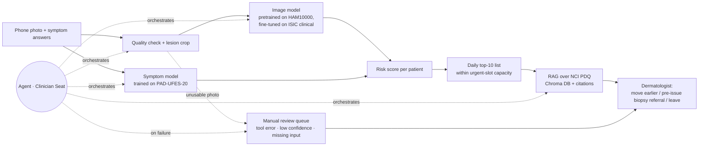

# Project Charter · Skin Lesion Triage for Healthcare Providers

**Team:** Ifat Davidson · Tami Khazma · Roi Budnitsky · Yuval Rubenchuk | **Course:** BIU DS23 Capstone | **Date:** 25.9.2026
**Retrieval asset:** the module 5 grounded assistant.

## 1 · Problem & User
**User:** A dermatologist working within an Israeli healthcare fund (e.g., Clalit, Maccabi) who manages an overloaded appointment queue.

**Pain:**  the dermatologist cannot tell which patient on the waiting list cannot wait.
A public-system dermatologist appointment in Israel takes a median of **24.5 days**, rising by **8.5 days a year**, and reaches **40–42 days** in Tel Aviv and Jerusalem ¹.
Clalit's and Maccabi's online dermatology services explicitly exclude moles and suspected skin cancer.² These cases therefore require in-person assessment. In the absence of a dedicated pre-visit image-triage mechanism, the waiting list itself does not reveal which lesions are most urgent. A malignant lesion may therefore remain in the standard queue until it is reviewed by a clinician.

**What we build:** while waiting for their appointment, The patient uploads a smartphone photograph of the lesion and fills out a brief symptom form via the healthcare fund's app. The system scores every patient on the waiting list. Every morning it shows the dermatologist a **short list of up to 10 suspicious cases**, each with the photo, the answers and cited reasons.
For each case, the dermatologist decides whether to move the patient to an earlier in-person appointment and, where clinically and operationally appropriate, whether to issue a biopsy referral in advance to accelerate the diagnostic workup.

**Safety principle:** the system can only move a patient *earlier*. A patient who is not flagged keeps their regular appointment, so a miss costs at most today's situation. The patient never sees a risk score or a diagnosis, and the dermatologist decides on every case.
  
**AI-deletion test:** Without AI the problem remains: dozens of photos arrive every day, and no dermatologist can review them all in time to find the few that cannot wait. The AI-deletion test safely automates this triage by filtering out false alarms and verifying true clinical urgency.

## 2 · Success metrics (fixed before any code)

| # | Metric | Target |
|---|---|---|
M1 | Median simulated days to appointment for patients with malignant lesions (MEL + BCC + SCC), under the predefined waiting-list scenarios and fixed urgent-slot capacity | ≤ 7 days in the primary simulation scenario; always reported alongside the absolute and percentage reduction versus the FIFO baseline |
M2 | Patient-level sensitivity for skin cancer (MEL + BCC + SCC → flagged for high-urgency dashboard triage) on held-out PAD-UFES-20 patients (real phone photos) | ≥ 0.90, reported with 95% confidence intervals and absolute TP/FN counts. Melanoma sensitivity is also reported separately. |
| M3 | Groundedness on a frozen set of 20 guidance questions (5 unanswerable), plus a check that each number appears in its cited source | ≥ 0.9, and 5/5 refusals |
M4 | Agent scenario set of 15 complex workflow cases | ≥ 13/15 correct; zero cases in which the agent suppresses, downgrades or removes a patient who was flagged by the validated deterministic triage policy. |

All predictive metrics are computed at the patient level. For patients with multiple images, the aggregation rule is defined and frozen before test-set evaluation.

Sensitivity comes before list length: a missed melanoma costs far more than one extra case for the dermatologist to review. All metrics are stratified by skin tone (the PAD Fitzpatrick field and the MILK10k skin-tone field) and by patient age group. The simulation is run at 5, 10 and 15 urgent slots a day, and at 5%, 10% and 20% malignant prevalence, because the real mix is unknown.
Because the real-world prevalence is unknown, queue-level metrics are interpreted as scenario results rather than estimates of current healthcare-fund performance.

## 3 · Data (all four checks run 18–19.9; details in [`docs/DATA_DECISIONS.md`](docs/DATA_DECISIONS.md))
| Source | Role | Size | Why | Licence |
|---|---|---|---|---|
| **ISIC Archive**, clinical (non-dermoscopic) images, incl. MILK10k | **Main training data** | 8,837 images, **522 melanomas**, 1,005 nevi | The largest pool of non-dermoscopic images with enough melanomas; the closest public proxy for a phone photo | CC-BY-NC / CC-BY (per image) |
| **PAD-UFES-20** | **Test set** of real phone photos; the only source with symptoms; training only from patients outside the test split | 2,298 images, 1,373 patients, **52 melanomas** | The only source actually shot on smartphones, and the only one with the symptom answers our app collects. Too small to train on alone | CC BY 4.0 |
| **HAM10000** | **Pretraining only** | 10,015 images, 1,113 melanomas | Dermoscopic (10× magnification, polarised light), so it shows subsurface structures a phone cannot capture. Useful as a starting point for the network, never as the target domain | CC BY-NC 4.0 |
| **NCI PDQ** patient summaries | Guidance corpus for the RAG | ~10–20 documents | Official, citable text for the reasons shown to the dermatologist | Free of copyright; credit NCI |

**PAD appears twice** (on Mendeley and inside the ISIC Archive). We use one copy only; otherwise every PAD image would be duplicated across train and test.

**Rejected:**
- `BCN20000`: dermoscopic only, so beyond HAM10000 it adds volume and no new domain.
- `marmal88/skin_cancer`: a re-upload whose 13,354 rows hold only 10,015 unique images. **79.8% of its test images are also in train.**
- `Fitzpatrick 17k`: atlas photos, mostly non-cancerous conditions, with no age, sex or body site. Only **10 of 40 sampled image links still work**. Its advantage, diverse skin tones, does not survive the dead links.
- **Generative phone-to-dermoscopic conversion**: a generator would invent subsurface structures that the phone never captured. Unsafe for a medical product.

**Skin-tone reporting without DDI:** M2 is stratified by the Fitzpatrick field in PAD-UFES-20 (our test set) and the MILK10k skin-tone field (0–5) inside ISIC. Both skew light, so performance on Fitzpatrick V–VI stays an **open limitation** that we state rather than hide.

flowchart LR
    %% Data Input & Quality Routing
    A[Phone photo + symptom answers] --> B[Quality check + lesion crop]
    
    %% Error and Low-Confidence Routing (Fail-safe)
    B -. unusable photo / low confidence .-> M[Manual review queue tool error · missing input]
    M --> F[Dermatologist: move earlier / pre-issue biopsy / leave]

    %% Core Machine Learning Pipeline
    B --> C[Image model pretrained on HAM10000, fine-tuned on ISIC clinical]
    A --> S[Symptom model trained on PAD-UFES-20]
    
    %% NEW: Explainability Verification (AI-Deletion Test)
    C --> XAI[AI-deletion test Explainability Validation]

    %% Knowledge Base Layer (Fixed Position)
    VectorDB[(Vector DB)] <--> RAG[RAG over NCI PDQ Chroma DB + citations]

    %% Core Logic & Capacity Management
    XAI & S & RAG --> D[Risk score per patient]
    D --> L[Daily top-10 list within urgent-slot capacity]
    L --> F

    %% Human-in-the-Loop Feedback Loop (Continuous Learning)
    F -.-> |Model improvement feedback| C & S

    %% Agent Supervision Layer
    G((Agent · Clinician Seat)) -. orchestrates .-> B & C & S & RAG & D
    G -. on failure .-> M

  
## 4 · Architecture

The system runs end-to-end as a multi-modal pipeline, utilizing an orchestrating agent to manage quality checks and contextual delivery to the clinician.

It works end to end without the agent: both models score each patient, the deterministic ranking policy fills the day's urgent slots, and each case receives a fixed model-evidence summary containing the relevant score bands, symptom flags and image-quality status

### Baseline Evaluation Table
To justify the multi-modal design, the pipeline will be benchmarked against the following baselines (evaluated strictly on the same held-out PAD-UFES-20 test patients):

1. **Arrival order (today's practice):** every patient waits for their regular slot, a median of 24.5 days.¹ This is what M1 is measured against, and the only baseline that represents the current system.
2. **Metadata Only (The Floor):** A standard Logistic Regression model trained purely on patient age, sex, and the symptom checklist. *The baseline bar to beat is an AUC of 0.90 established during Exploratory Data Analysis (EDA).*
3. **Image Model Alone:** The vision component evaluated independently (fine-tuned on clinical images) to isolate the predictive power of visual features.
4. The Selected Integrated Triage Model (Multi-modal): Image Model + Symptom Model + fusion layer, evaluated against M1 and M2.
The RAG explanation layer is evaluated separately under M3 and is not counted as part of predictive performance.

## 5 · Agent Seat
- **Decision (what a fixed script cannot do):** for each case the agent decides whether the photo is usable or the patient must be asked for a retake, **which follow-up question is worth asking** (a change over time is the melanoma signal, 16.8% vs 0.5%; bleeding points to BCC), which guideline passages support this particular case, and when missing information should send the case to manual review instead of into the automated flow. It assembles the evidence the dermatologist sees. **It never sets, modifies or overrides the validated risk score or the deterministic ranking that fills the daily slots.**
- **Tools:** `check_image_quality`, `request_retake`, `ask_patient`, `predict_visual_risk`, `score_symptoms`, `retrieve_guidance_context`, `draft_biopsy_referral`.
- On failure: Fall back to the non-agent path. Any tool error, low confidence or missing critical input routes the case to a separate manual-review queue and never lowers its validated model priority or removes its regular appointment.
- **Guardrails:**
  * **The agent never issues a biopsy referral and never books an appointment on its own. It only drafts, and the dermatologist approves every action.**
  * Strict prohibition of "benign" or "safe" diagnostic wording in the dashboard or patient communications.
  * The patient receives a neutral message ("your photo was received and will be reviewed") and never a risk estimate.
  * Explicit "I don't know" fallback if clinical inquiries fall outside the verified NCI PDQ guidance corpus.
  * Patient-submitted text is treated as data, never as instructions.
  * Users under the age of 18 are automatically routed to direct clinical review regardless of AI score.

## 6 · Risks and cut line
| Risk | Mitigation |
|---|---|
| **Missing fields leak the label** (In PAD-UFES-20, missing field counts alone yield an artifactual AUC of 0.83) | Explicitly restrict training to the subset of features uniformly collected by the app's mandatory onboarding flow. |
| **Patient data leakage** (Naive splits place different photos of the same patient across train/test splits) | Split data strictly at the **Patient ID** level, ensuring a patient's images never span across both training and evaluation sets. |
| **Prevalence mismatch** (51% of the ISIC clinical images are malignant, because they are lesions that were chosen for biopsy) | **Fill a fixed daily capacity (top-10) rather than rely on a probability threshold**; present cases to the dermatologist as a ranked list, never as raw probabilities. |
| **Data domain gap** (Patients shooting photos with poor lighting, blurry focus, or lens artifacts) | Use PAD-UFES-20, the only source actually shot on smartphones, to train the input filter to reject unreadable images and prompt an immediate re-take. |
| **No verified dark-skin test data.** Both skin-tone sources skew light | Report M2 per Fitzpatrick bin with confidence intervals; state that Fitzpatrick V–VI performance is unvalidated, and list it as the first requirement for a clinical pilot |

**Cut line:** *If only two weeks remain, we drop the agent and the biopsy-referral draft, and ship the core pipeline: smartphone photo + symptom form → ranked waiting list → daily top-10 with a fixed reason per score band.*

## 7 · Milestones and hats
| Date | Deliverable |
|---|---|
| 25.9 | Finalized Product Charter & Data Verification ✅ |
| 2.10 | Patient-level data splitting, leakage audits, and cross-dataset dictionary alignment |
| **18.10 · CP1** | Core End-to-End Pipeline (No Agent); Baseline Evaluation; M3 Groundedness Benchmark |
| **1.11 · CP2** | Agent Orchestration Layer Integrated; M4 Validation; 1-Minute Live Demo |
| 12.11 | Codebase Freeze, Repository Cleanup, and Stakeholder Presentation Deck |

| Hat | Owner | Responsibility |
|---|---|---|
| Data | Ifat Davidson | Pipeline architecture, strict patient-level splitting, data cleaning, and leakage mitigation |
| Model | Tami Khazma | Training baselines, model fine-tuning, threshold tuning, and multi-ethnic performance analysis |
| Agent | Roi Budnitsky | Agent tool building, orchestration loops, safety guardrails, and M4 validation set execution |
| Product | Yuval Rubenchuk | Clinician workflow UX, patient-facing safety copy, README documentation, and final fund presentation deck |

---
¹ Murad H et al. *Measuring geographical disparities in waiting times for community-based specialist care.* Israel Journal of Health Policy Research, 2025. [doi:10.1186/s13584-025-00702-7](https://doi.org/10.1186/s13584-025-00702-7). Covers all dermatologists in all four health funds, 2019–2023.

² Maccabi, [online dermatologist consultation](https://www.maccabi4u.co.il/31276/digital-services/communication/consultation_dermatologists/): "not intended for urgent cases or for diagnosing moles and skin lesions". Clalit, [online dermatologists](https://www.clalit.co.il/he/online_doctors/Pages/dermatologist_on_line.aspx): excludes "diagnosis and assessment of nevi" and suspected skin cancer. Both checked 18.9.2026.
