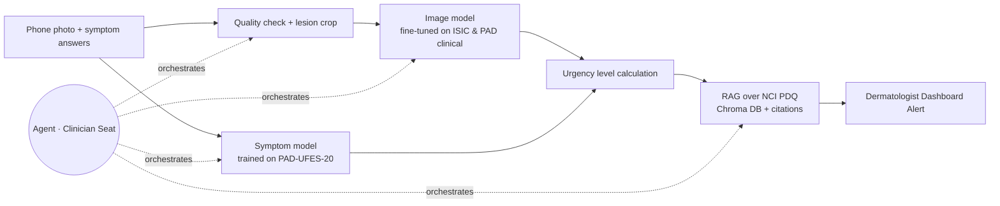

# Project Charter · Skin Lesion Triage for Healthcare Providers

**Team:** Ifat Davidson · Tami Khazma · Roi Budnitsky · Yuval Rubenchuk | **Course:** BIU DS23 Capstone | **Date:** 25.9.2026
**Retrieval asset:** the module 5 grounded assistant.

## 1 · Problem & User
**User:** A dermatologist working within an Israeli healthcare fund (e.g., Clalit, Maccabi) who manages an overloaded appointment queue.

**Pain:**  the dermatologist cannot tell which patient on the waiting list cannot wait.
A public-system dermatologist appointment in Israel takes a median of **24.5 days**, rising by **8.5 days a year**, and reaches **40–42 days** in Tel Aviv and Jerusalem ¹.
In that queue a melanoma waits exactly as long as a harmless mole, and the dermatologist has no way to know which patient it is until the visit itself.

**What we build:** while waiting for their appointment, The patient uploads a smartphone photograph of the lesion and fills out a brief symptom form via the healthcare fund's app. The system scores every patient on the waiting list. Every morning it shows the dermatologist a **short list of up to 10 suspicious cases**, each with the photo, the answers and cited reasons.
For each case the dermatologist decides whether to **move the patient to an earlier in-person appointment** and whether to 
**issue a biopsy referral in advance**, so the biopsy is done at the first visit instead of a second one.
**Safety principle:** the system can only move a patient *earlier*. A patient who is not flagged keeps their regular appointment, so a miss costs at most today's situation. The patient never sees a risk score or a diagnosis, and the dermatologist decides on every case.
  
**AI-deletion test:** Without AI the problem remains: dozens of photos arrive every day, and no dermatologist can review them all in time to find the few that cannot wait.
The AI-deletion test is integrated into the system to validate the algorithm's clinical reasoning, ensuring that urgency-triage decisions are based on actual dermatological anomalies rather than visual noise, thereby optimizing clinic scheduling and reducing false-positive appointments 

## 2 · Success metrics (fixed before any code)

| # | Metric | Target |
|---|---|---|
| M1 | **Median days to appointment for malignant lesions** (MEL + BCC + SCC), in a waiting-list simulation with 10 urgent slots a day | **≤ 7 days** (today: 24.5¹) |
| M2 | Sensitivity for skin cancer** (MEL + BCC + SCC → flagged for high-urgency dashboard triage) on **held-out PAD-UFES-20 patients** (real phone photos) | **≥ 0.90**
| M3 | Groundedness on a frozen set of 20 guidance questions (5 unanswerable), plus a check that each number appears in its cited source | ≥ 0.9, and 5/5 refusals |
| M4 | Agent scenario set of 15 complex clinical workflows | ≥ 13/15 correct; **zero** malignant cases left untriaged in the standard queue |

Sensitivity comes before list length: a missed melanoma has catastrophic clinical consequences compared to a false positive triage flag. To ensure diagnostic equity and mitigate systemic bias, all metrics will be stratified and reported across both distinct skin tones (utilizing the DDI dataset) and patient age groups.

## 3 · Data (all four checks passed, 18–19.9)
| Source | Role | Size | Layout / Image Type | Skin Tone Bias Mitigation |
|---|---|---|---|---|
| **ISIC Archive** (Clinical subsets) |Main training & testing data| 8,837 images, 522 melanomas | Filtered explicitly for **Clinical/Macro images** (excluding dermoscopic) | Primarily light skin tones; used strictly for structural feature extraction. |
| **PAD-UFES-20** | Supplementary training | 2,298 images, 1,373 patients, 52 melanomas | **Smartphone (Clinical)** close-ups; includes rich patient metadata (age, sex, itch, bleed, history) | Includes diverse, multi-ethnic patient samples from Brazil. |
| **DDI (Diverse Dermatology Images)** | Skin-tone validation and bias test set | 656 images | **Smartphone & Clinical** images with verified biopsy gold standards | **Crucial MVP Addition:** Perfectly balanced across Fitzpatrick skin tones (I-VI) to test and prevent algorithmic bias on dark skin. |
| **NCI PDQ** patient summaries | Guidance corpus for RAG | ~10–20 documents | Clinical text reference | N/A |

**Rejected:** 
- `HAM10000` & `BCN20000`: Completely dermoscopic. Since our MVP relies on patient-shot smartphone photos, dermoscopic data introduces an unacceptable domain gap.
- `marmal88/skin_cancer`: High data leakage (80% of its test set is present in the training set).
- `Fitzpatrick 17k`: More than 75% of the original image URLs are dead.
  
## 4 · Architecture

The system runs end-to-end as a multi-modal pipeline, utilizing an orchestrating agent to manage quality checks and contextual delivery to the clinician.

### Baseline Evaluation Table
To justify the multi-modal design, the pipeline will be benchmarked against the following baselines (evaluated strictly on the same held-out PAD-UFES-20 test patients):
1. **Metadata Only (The Floor):** A standard Logistic Regression model trained purely on patient age, sex, and the symptom checklist. *The baseline bar to beat is an AUC of 0.90 established during Exploratory Data Analysis (EDA).*
2. **Image Model Alone:** The vision component evaluated independently (fine-tuned on clinical images) to isolate the predictive power of visual features.
3. **The Selected Integrated MVP System (Multi-modal):** The full pipeline combining the Image Model + Symptom Model + RAG clinical explanation, routed directly into the Dermatologist Dashboard.

## 5 · Agent Seat
- **Decision:** Determines whether the uploaded smartphone photo meets clinical quality standards, decides which specific follow-up context is required, and orchestrates the fusion of visual risk scores, clinical history, and symptoms into a final dashboard prioritization tier.
- **Tools:** `check_image_quality`, `predict_visual_risk`, `score_symptoms`, `retrieve_guidance_context`, `flag_high_urgency`.
- **On failure:** Fall back to the non-agent path. Any error, low confidence, or missing data defaults to **"High Urgency / Refer to Clinician Immediately"**.
- **Guardrails:**
  * Strict prohibition of "benign" or "safe" diagnostic wording in the dashboard or patient communications.
  * Explicit "I don't know" fallback if clinical inquiries fall outside the verified NCI PDQ guidance corpus.
  * Users under the age of 18 are automatically routed to direct clinical review regardless of AI score.

## 6 · Risks and cut line
| Risk | Mitigation |
|---|---|
| **Missing fields leak the label** (In PAD-UFES-20, missing field counts alone yield an artifactual AUC of 0.83) | Explicitly restrict training to the subset of features uniformly collected by the app's mandatory onboarding flow. |
| **Patient data leakage** (Naive splits place different photos of the same patient across train/test splits) | Split data strictly at the **Patient ID** level, ensuring a patient's images never span across both training and evaluation sets. |
| **Prevalence mismatch** (The clinical datasets feature artificial, heavily inflated rates of malignancy) | Dynamically tune the classification threshold to prioritize M1 (Sensitivity); represent outputs to doctors as risk tiers, never raw statistical probabilities. |
| **Data domain gap** (Patients shooting photos with poor lighting, blurry focus, or lens artifacts) | Use the DDI and PAD-UFES-20 datasets to explicitly train the input filter to reject unreadable images and prompt immediate re-takes. |

**Cut line:** *If the implementation timeline is compressed to under two weeks, drop the dynamic agent logic and focus entirely on deploying the core pipeline: Smartphone Photo + Symptom Form → Algorithmic Urgency Tiering → Dermatologist Dashboard UI.*

## 7 · Milestones and hats
| Date | Deliverable |
|---|---|
| 25.9 | Finalized Product Charter & Data Verification ✅ |
| 2.10 | Patient-level data splitting, leakage audits, and cross-dataset dictionary alignment |
| **18.10 · CP1** | Core End-to-End Pipeline (No Agent); Baseline Evaluation; M3 Groundedness Benchmark |
| **1.11 · CP2** | Agent Orchestration Layer Integrated; M4 Validation; 1-Minute Live Demo |
| 12.11 | Codebase Freeze, Repository Cleanup, and Stakeholder Presentation Deck |

| Hat | Owner | Responsibility |
|---|---|---|
| Data | Ifat Davidson | Pipeline architecture, strict patient-level splitting, data cleaning, and leakage mitigation |
| Model | Tami Khazma | Training baselines, model fine-tuning, threshold tuning, and multi-ethnic performance analysis |
| Agent | Roi Budnitsky | Agent tool building, orchestration loops, safety guardrails, and M4 validation set execution |
| Product | Yuval Rubenchuk | Clinician workflow UX, patient-facing safety copy, README documentation, and final fund presentation deck |

---
¹ Murad H et al. *Measuring geographical disparities in waiting times for community-based specialist care.* Israel Journal of Health Policy Research, 2025. [doi:10.1186/s13584-025-00702-7](https://doi.org/10.1186/s13584-025-00702-7). Covers all dermatologists in all four health funds, 2019–2023.
