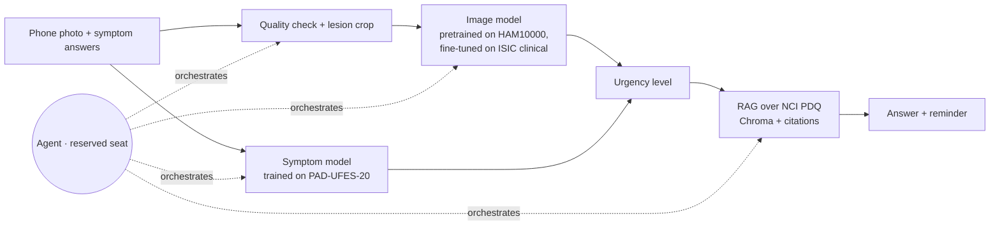

# Project Charter · Skin Lesion Assistant

**Team:** Ifat Davidson · Roi Budnitsky · Yuval Rubenchuk · Tami Kazma | **Course:** BIU DS23 Capstone | **Date:** 25.9.2026
**Retrieval asset:** the module 5 grounded assistant, contributed by Ifat Davidson. **Evidence:** `notebooks/01_eda_data_sources.ipynb`, [`docs/DATA_DECISIONS.md`](docs/DATA_DECISIONS.md).

## 1 · Problem and user
**User:** an adult who notices a mole that worries them and has only a smartphone.

**Pain:** a public-system dermatologist appointment in Israel takes a median of **24.5 days**, rising by **8.5 days a year**, and **40–42 days** in Tel Aviv and Jerusalem.¹ People postpone the visit because the spot "is probably nothing", so the rare dangerous lesions are seen late, although early detection is what changes the outcome for melanoma.

**What we build:** the user photographs the spot and answers a few questions (did it change, grow, bleed, itch?). The app returns an **urgency level**:
- see a doctor within days;
- mention it at your next visit;
- photograph it again in 3 months.

Each level comes with a short explanation that cites its source, and a re-check reminder. This is **triage, not diagnosis**: the app never says "benign".

**AI-deletion test:** without AI, people still cannot judge whether a spot is urgent, and the queue is too long for everyone.

## 2 · Success metrics (fixed before any code)
| # | Metric | Target |
|---|---|---|
| M1 | **Sensitivity for skin cancer** (MEL + BCC + SCC → "see a doctor") on **held-out PAD-UFES-20 patients** (real phone photos) | **≥ 0.90** |
| M2 | Specificity at the M1 threshold (proxy for fewer unnecessary visits) | ≥ 0.50 |
| M3 | Groundedness on a frozen set of 20 guidance questions (5 unanswerable), plus a check that each number appears in its cited source | ≥ 0.9, and 5/5 refusals |
| M4 | Agent scenario set of 15 cases | ≥ 13/15 correct; **zero** malignant cases reassured |

M1 comes before M2 on purpose: a missed melanoma costs far more than an extra visit. M1 and M2 are also reported per source and per skin tone.

## 3 · Data (all four checks passed, 18–19.9)
| Source | Role | Size | Licence |
|---|---|---|---|
| **ISIC Archive**, clinical close-ups (incl. MILK10k) | Main training data | 8,837 images, **522 melanomas**, 1,005 nevi | CC-BY-NC / CC-BY (per image) |
| **PAD-UFES-20** | Phone-photo test set; the only source with symptoms | 2,298 images, 1,373 patients, 52 melanomas | CC BY 4.0 |
| **HAM10000** | Pretraining only (dermoscopic) | 10,015 images | CC BY-NC 4.0 |
| **NCI PDQ** patient summaries | Guidance corpus for the RAG | ~10–20 documents | Free of copyright |

**Rejected:** `marmal88/skin_cancer` (80% of its test set is in train), BCN20000 (dermoscopic), Fitzpatrick 17k (75% of image links dead). Details: `docs/DATA_DECISIONS.md`.

**Plan B:** if phone photos give no usable signal, the user becomes a **family doctor with a dermatoscope**, and the main data becomes HAM10000 plus the ISIC dermoscopic images. The architecture stays the same.

## 4 · Architecture

**It works end to end without the agent.**

**Baseline table** (same PAD test patients, same metrics):
1. Metadata only, logistic regression. **This is the bar to beat: AUC 0.90 in the EDA.**
2. The HAM10000 model applied as-is (measures the domain gap).
3. The fine-tuned image model.
4. The chosen system: image model plus symptom model.

## 5 · Agent seat
- **Decision:** which follow-up questions to ask for this photo, whether the photo is usable, and how to combine the image score, the symptoms and any change since the last photo into one urgency level.
  - The EDA shows why the question choice matters: "bleeds" points to BCC, while **"changed"** is the melanoma signal (16.8% vs 0.5%).
- **Tools:** `check_image_quality`, `predict_risk`, `score_symptoms`, `ask_user`, `compare_with_previous`, `retrieve_guidance`, `schedule_reminder`.
- **On failure:** fall back to the non-agent path. Any error or low confidence resolves to **"see a doctor"**.
- **Guardrails:**
  - no "benign" wording;
  - "I don't know" outside the guidance corpus;
  - user text is treated as data, not instructions;
  - users under 18 are always referred.

## 6 · Risks and cut line
| Risk | Mitigation |
|---|---|
| **Missing fields leak the label** (in PAD, the count of missing fields alone reaches AUC 0.83) | Use only fields the app always asks |
| **Duplicates leak** (a naive split puts 43% of PAD test images next to their own lesion in train) | Split by patient, or by lesion when no patient ID exists; remove overlap between MILK10k and HAM10000 |
| **Prevalence mismatch** (51% of training images are malignant) | Tune the threshold for M1; never show the output as a probability |
| **Few melanomas in phone photos** (52) | Binary target; report melanoma results separately, with confidence intervals |

**Cut line:** *if only two weeks remain, we drop the agent and photo tracking, and ship phone photo + symptom form → urgency level + guidance with its source.*

## 7 · Milestones and hats
| Date | Deliverable |
|---|---|
| 25.9 | Charter; data checks ✅ |
| 2.10 | Patient- and lesion-level splits, leakage checks, data dictionary |
| **18.10 · CP1** | End to end without the agent; baseline table; M3 measured |
| **1.11 · CP2** | Agent integrated; M4 scored; 1-minute demo |
| 12.11 | Repo freeze and deck |

| Hat | Owner | Owns |
|---|---|---|
| Data | [assign] | Pipeline, splits, leakage checks, data dictionary |
| Model | [assign] | Baselines, fine-tuning, thresholds, error analysis |
| Agent | [assign] | Tools, loop, guardrails, M4 set |
| Product | [assign] | User story, safety wording, README, deck |

---
¹ Murad H et al. *Measuring geographical disparities in waiting times for community-based specialist care.* Israel Journal of Health Policy Research, 2025. [doi:10.1186/s13584-025-00702-7](https://doi.org/10.1186/s13584-025-00702-7). Covers all dermatologists in all four health funds, 2019–2023.
