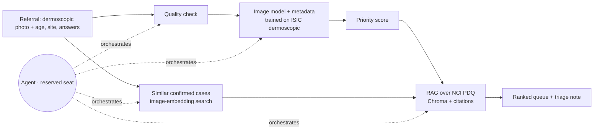

# Project Charter · Smart Screening: Optimizing the Healthcare Pipeline from Primary Care to Specialist

**Team:** Ifat Davidson · Tami Khazma · Roi Budnitsky · Yuval Rubenchuk | **Course:** BIU DS23 Capstone | **Date:** 25.9.2026
**Retrieval asset:** the module 5 grounded assistant.

## 1 · Problem & User
**User:** A dermatologist working within an Israeli healthcare fund (e.g., Clalit, Maccabi) who manages an overloaded appointment queue, alongside a patient who captures a photo of a worrying mole using their smartphone.

**Pain:** A public-system dermatologist appointment in Israel takes a median of **24.5 days**, rising by **8.5 days a year**, and reaches **40–42 days** in Tel Aviv and Jerusalem. Patients often delay visits because they assume a spot "is probably nothing," causing rare, malignant lesions to be caught late. Meanwhile, dermatologists spend significant time examining benign lesions due to a lack of an efficient preliminary filtering mechanism.

**What we build:** The patient uploads a smartphone photograph of the lesion and fills out a brief symptom form via the healthcare fund's app. This data is **forwarded directly to a dermatologist's triage dashboard**. The AI analyzes the inputs to calculate a **preliminary risk score and flags high-urgency cases**, allowing the dermatologist to review the image remotely and fast-track urgent appointments (e.g., within 48 hours) or initiate immediate clinical workflows. This optimizes the queue system without rendering an autonomous, final diagnosis to the patient.
  
**AI-deletion test:** Without AI, the dermatologist's dashboard receives an unstructured, un-prioritized backlog of photos, forcing them to review images chronologically. This completely defeats the purpose of an automated urgency-based queue acceleration.

## 2 · Success metrics (fixed before any code)

| # | Metric | Target |
|---|---|---|
| M1 | **Sensitivity for skin cancer** (MEL + BCC + SCC → flagged for high-urgency dashboard triage) on **held-out PAD-UFES-20 patients** (real phone photos) | **≥ 0.90** |
| M2 | Specificity at the M1 threshold (proxy for reducing unnecessary clinician triage alerts) | ≥ 0.50 |
| M3 | Groundedness on a frozen set of 20 guidance questions (5 unanswerable), plus a check that each number appears in its cited source | ≥ 0.9, and 5/5 refusals |
| M4 | Agent scenario set of 15 complex clinical workflows | ≥ 13/15 correct; **zero** malignant cases left untriaged in the standard queue |

M1 takes strict precedence over M2: a missed melanoma has catastrophic clinical consequences compared to a false positive triage flag. To ensure diagnostic equity and mitigate systemic bias, all metrics will be stratified and reported across both distinct skin tones (utilizing the DDI dataset) and patient age groups.

## 3 · Data (four checks run 18–19.9 via the public ISIC API)
| Source | Role | Size | Licence |
|---|---|---|---|
| **ISIC Archive**, dermoscopic images | Main training pool (deduplicated) | 124,961 images: **10,482 melanomas**, 21,652 malignant, 48,463 nevi. Includes HAM10000 (11,719) and BCN20000 (18,946) | Per image: CC-0 / CC-BY / CC-BY-NC |
| **MILK10k**, dermoscopic half | **External test set** | 5,240 lesions, 95.7% confirmed by histopathology, skin tone 0–5 | CC-BY-NC |
| **HAM10000** (Harvard Dataverse) | Development subset and baselines | 10,015 images, 1,113 melanomas | CC BY-NC 4.0 |
| **NCI PDQ** (health-professional summaries) | Guidance corpus for the triage note | ~10–20 documents | Free of copyright; credit NCI |

**Patient data available:** age, sex, body site (all sources); skin tone (MILK10k). Symptoms (changed, bleeds) are **not** in dermoscopic datasets. The agent asks the referring doctor for them, and their weight comes from the guidelines, not from training data.

**Plan B:** if harmonizing the full ISIC pool takes too long, train on HAM10000 only and keep MILK10k as the external test. That combination is enough for every metric.

## 4 · Architecture

**It works end to end without the agent:** the model scores each referral, the queue is sorted by score, and each case gets a fixed guidance paragraph for its score band.

This keeps both RAG paths from the original draft: path 1 retrieves prior confirmed cases, path 2 retrieves guidelines.

**Baseline table** (same queues, same metrics):
1. **Arrival order.** This is today's practice.
2. Metadata only: logistic regression on age, sex and site.
3. The classic ABCD dermoscopy score (TDS).
4. The image model alone.
5. The chosen system: image model plus metadata.

## 5 · Agent seat
- **Decision (what a script can't do):** for each referral, decide whether the photo is usable or the doctor must retake it, which missing clinical facts to request (a change over time matters for melanoma; bleeding points to BCC), which similar cases and guideline passages support the priority, and when uncertainty should raise the case rather than lower it.
- **Tools:** `check_image_quality`, `score_lesion`, `find_similar_cases`, `request_info_from_referrer`, `retrieve_guidance`, `write_triage_note`.
- **On failure:** fall back to ranking by model score only. Any error or low confidence moves the case **up** the queue, never down.
- **Guardrails:**
  - never closes or dismisses a referral;
  - never states a diagnosis, only a priority with cited reasons;
  - "I don't know" outside the guidance corpus;
  - referral text is treated as data, not instructions.

## 6 · Risks and cut line
| Risk | Mitigation |
|---|---|
| **The dermatologist's pain is not yet validated** | Interview at least one dermatologist before 4.10; adjust the metric to what they actually lose time on |
| **Do family doctors have dermatoscopes?** (unknown for Israel) | Ask in the same interview; the fallback is referral from a dermoscopy nurse or a mole-mapping clinic |
| **Duplicates across collections** (HAM10000 and BCN20000 inside ISIC; MILK10k lesions may have earlier ISIC images) | Deduplicate by ISIC ID and lesion; remove any MILK10k lesion seen in training |
| **Prevalence mismatch** (training data is biopsy-heavy) | Queue metrics at three prevalence levels; never present the score as a probability |

**Cut line:** *if only two weeks remain, we drop the agent and case retrieval, and ship a ranked queue + fixed guidance paragraph per score band.*

## 7 · Milestones and hats
| Date | Deliverable |
|---|---|
| 25.9 / 4.10 | Charter (internal target / official deadline); dermatologist interview |
| 2.10 | Deduplicated dataset, lesion-level splits, queue simulator, data dictionary |
| **18.10 · CP1** | End to end without the agent; 5-row baseline table; M3 measured |
| **30.10 · CP2** | Agent integrated; M4 scored; 1-minute demo |
| 12.11 | Repo freeze and deck |

| Hat | Owner | Owns |
|---|---|---|
| Data | [assign] | ISIC pipeline, deduplication, splits, queue simulator, data dictionary |
| Model | [assign] | Baselines, image model, ranking metrics, error analysis |
| Agent | [assign] | Tools, loop, guardrails, M4 scenario set |
| Product | [assign] | Dermatologist interview, triage-note wording, README, deck |

---
¹ Murad H et al. *Measuring geographical disparities in waiting times for community-based specialist care.* Israel Journal of Health Policy Research, 2025. [doi:10.1186/s13584-025-00702-7](https://doi.org/10.1186/s13584-025-00702-7)
² Maccabi, [online dermatologist consultation](https://www.maccabi4u.co.il/31276/digital-services/communication/consultation_dermatologists/): "not intended for urgent cases or for diagnosing moles and skin lesions". Clalit, [online dermatologists](https://www.clalit.co.il/he/online_doctors/Pages/dermatologist_on_line.aspx): excludes "diagnosis and assessment of nevi" and suspected skin cancer. Both checked 18.9.2026.
