# Data Decisions · Skin Lesion Assistant

This file backs the data section of [CHARTER.md](../CHARTER.md). All numbers come from checks against the original sources, run on 18–19.9.2026.

## 1 · Four checks per source
| Source | Access | Size | Licence | Signal |
|---|---|---|---|---|
| **ISIC Archive**, clinical close-ups, incl. MILK10k (main training data) | ✅ Public API, no account | ✅ 8,837 labelled images (479 without a diagnosis dropped): **522 melanomas**, 1,005 nevi. MILK10k: 5,240 lesions, 95.7% confirmed by histopathology, skin-tone field 0–5 | ⚠️ Per image: CC-BY-NC 5,719 (all of MILK10k) · CC-BY 3,545 · CC-0 52. Only 72 melanomas are usable commercially | ✅ Age + sex + site alone: ROC-AUC 0.74 (GroupKFold) |
| **PAD-UFES-20** (phone-photo test set) | ✅ Metadata CSV from Mendeley; images also in ISIC | ⚠️ 2,298 images · 1,641 lesions · 1,373 patients · **52 melanomas** | ✅ CC BY 4.0 (checked on Mendeley) | ✅ Age + site + 6 symptoms: ROC-AUC 0.90 (GroupKFold by patient) |
| **HAM10000** (pretraining) | ✅ Harvard Dataverse, direct download | ✅ 10,015 images · 7,470 lesions · 1,113 melanomas | ⚠️ CC BY-NC 4.0 (checked on Dataverse) | ✅ Established for dermoscopic images; limited for phone photos (different domain) |
| **NCI PDQ** patient summaries (RAG corpus) | ✅ cancer.gov | ✅ ~10–20 documents | ✅ "All text within NCI products is free of copyright"; credit NCI | ⚠️ Coverage checked while writing the M3 question set |

## 2 · Rejected sources
| Source | Reason |
|---|---|
| **HAM10000 on Hugging Face** (`marmal88/skin_cancer`) | Its ready-made split leaks. The 13,354 rows contain only 10,015 unique images; **79.8% of the test images are also in train**, and 88.1% share a lesion with train. |
| **BCN20000** | Dermoscopic only, so it adds nothing for a phone user beyond HAM10000. |
| **Fitzpatrick 17k** | Only **10 of 40 sampled image links still work**. It has no patient data, and the images are atlas photos rather than phone photos. The skin-tone analysis uses the MILK10k field instead. |
| **Generative "phone-to-dermoscopic" conversion** | A dermatoscope (≈10× magnification, polarised light) captures subsurface structures that a phone camera cannot. A generator would invent them, which is unsafe for a medical app. |

## 3 · Findings that shape the design
- **Missing fields leak the label.** In PAD, fields such as smoking, history and Fitzpatrick type are missing in 60–85% of benign cases and 0% of cancers. The *count of missing fields alone* reaches ROC-AUC 0.83, and "all fields" reaches 0.949, partly through this leak. We use only fields the app always asks.
- **Symptoms separate cancer types.** "Bleeds" and "hurts" point to BCC and SCC (0% melanoma). **"Changed"** is the strongest melanoma signal: 16.8% melanoma when yes vs 0.5% when no.
- **Leakage through duplicates.** A naive image-level split puts 43% of PAD test images next to their own lesion in train (39% for HAM10000). MILK10k has no patient IDs. PAD lesion IDs differ between Mendeley (1,641) and ISIC (1,891).
- **Prevalence mismatch.** 51% of the ISIC clinical images are malignant, because they are lesions chosen for biopsy.

## 4 · Critical-inquiry experiments (planned)
1. **Domain gap:** train without PAD, test only on PAD (camera photos vs. real phone photos).
2. **Skin tone:** M1 and M2 per MILK10k skin-tone level.
3. **Age shortcut:** sensitivity for users under 40.
4. **Overlap check:** MILK10k lesions that also appear in HAM10000 (via the ISIC ID in the MILK10k metadata) are removed before pretraining and evaluation.

## 5 · Licensing and the path to a real product
Most images are CC-BY-NC, which is fine for the course. A commercial pilot would need:
- data licences from the contributing institutions, **or** our own data collection with Helsinki-committee approval and informed consent;
- regulatory approval as a medical device (in Israel from the MoH medical-device division, AMAR; CE in Europe; FDA in the US);
- legal advice on whether a model trained on non-commercial data may be used commercially.

```mermaid
flowchart LR
    %% Styling and Colors for a Professional Look
    classDef ingestion fill:#e3f2fd,stroke:#1565c0,stroke-width:2px,color:#0d47a1;
    classDef models fill:#f3e5f5,stroke:#6a1b9a,stroke-width:2px,color:#4a148c;
    classDef logic fill:#fff3e0,stroke:#e65100,stroke-width:2px,color:#d84315;
    classDef output fill:#e8f5e9,stroke:#2e7d32,stroke-width:2px,color:#1b5e20;
    classDef agent fill:#eceff1,stroke:#37474f,stroke-width:3px,color:#263238;

    %% Orchestration Layer
    Agent((Agent)):::agent
    Memory[(memory)]:::agent
    Memory <--> Agent

    %% Data Ingestion Pipeline
    USER[USER Access msg]:::ingestion --> trigger[trigger]:::ingestion
    trigger --> transcribe[transcribe]:::ingestion
    
    %% Multimodal Processing Split
    transcribe --> Intent[Specific intent]:::ingestion
    transcribe --> Crop[Quality check & lesion crop]:::ingestion

    %% Core AI Models & Explainability Validation
    Intent --> SymptomModel[Symptom model<br/>trained on PAD-UFES-20]:::models
    Crop --> ImageModel[Image model<br/>fine-tuned on ISIC & PAD clinical]:::models
    ImageModel --> DeletionTest[AI-deletion test<br/>Explainability Validation]:::models

    %% Knowledge Base & Retrieval
    VectorDB[(Vector DB)]:::logic <--> RAG[RAG over NCI PDQ<br/>Chroma DB + citations]:::logic

    %% Agent Control Flow
    Agent -. orchestrates .-> Intent
    Agent -. orchestrates .-> ImageModel
    Agent -. orchestrates .-> RAG
    Agent -. orchestrates .-> Triage

    %% Decision Making & Triage
    SymptomModel --> Triage[Urgency level calculation]:::logic
    DeletionTest --> Triage:::logic
    RAG --> Triage:::logic

    %% Clinical Output & Human-in-the-Loop Feedback
    Triage --> Dashboard[Dermatologist Dashboard Alert<br/>Optimized Appointment Scheduling]:::output
    Dashboard --> Feedback[Dr. feedback]:::output
    
    %% Retraining Feedback Loop
    Feedback -.-> |Model improvement| ImageModel & SymptomModel
```

