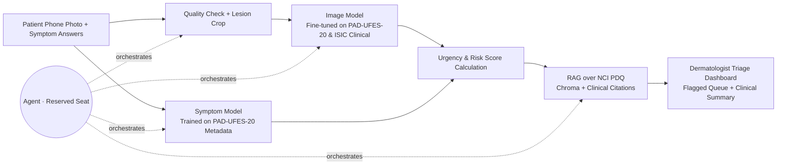

# Product Charter: Skin Lesion Triage for Healthcare Providers

## 1 · Problem and user
**User:** A **dermatologist** working within an Israeli healthcare fund (e.g., Clalit, Maccabi) who manages an overloaded appointment queue, alongside a **patient** who captures a photo of a worrying mole using their smartphone.

**Pain:** A public-system dermatologist appointment in Israel takes a median of **24.5 days**, rising by **8.5 days a year**, and reaches **40–42 days** in Tel Aviv and Jerusalem. Patients often delay visits because they assume a spot "is probably nothing," causing rare, malignant lesions to be caught late. Meanwhile, dermatologists spend significant time examining benign lesions due to a lack of an efficient preliminary filtering mechanism.

**What we build:** The patient uploads a smartphone photograph of the lesion and fills out a brief symptom form via the healthcare fund's app. This data is **forwarded directly to a dermatologist's triage dashboard**. The AI analyzes the inputs to calculate a **preliminary risk score and flags high-urgency cases**, allowing the dermatologist to review the image remotely and fast-track urgent appointments (e.g., within 48 hours) or initiate immediate clinical workflows. This optimizes the queue system without rendering an autonomous, final diagnosis to the patient.

**AI-deletion test:** Without AI, the dermatologist's dashboard receives an unstructured, un-prioritized backlog of photos, forcing them to review images chronologically. This completely defeats the purpose of an automated urgency-based queue acceleration.

## 2 · Success metrics (fixed before any code)
| # | Metric | Target |
|---|---|---|
| M1 | **Sensitivity for skin cancer** (MEL + BCC + SCC → "flagged as urgent") on **held-out PAD-UFES-20 patients** (real phone photos) | **≥ 0.90** |
| M2 | Specificity at the M1 threshold (proxy for fewer unnecessary dermatologist flags) | ≥ 0.50 |
| M3 | Groundedness on a frozen set of 20 guidance questions (5 unanswerable), plus a check that each number appears in its cited source | ≥ 0.9, and 5/5 refusals |
| M4 | Agent scenario set of 15 cases | ≥ 13/15 correct; **zero** malignant cases reassured |

*M1 takes strict precedence over M2: a missed melanoma has catastrophic clinical consequences compared to a false positive flag. Metrics will be stratified and reported across different skin tones to ensure equity.*

## 3 · Data (all four checks passed, 18–19.9)
| Source | Role | Size | Layout / Image Type | Skin Tone Bias Mitigation |
|---|---|---|---|---|
| **PAD-UFES-20** | Main training & testing data | 2,298 images, 1,373 patients, 52 melanomas | **Smartphone (Clinical)** close-ups; includes rich patient metadata (age, sex, itch, bleed, history) | Includes diverse, multi-ethnic patient samples from Brazil. |
| **DDI (Diverse Dermatology Images)** | Skin-tone validation and bias test set | 656 images | **Smartphone & Clinical** images with verified biopsy gold standards | **Crucial MVP Addition:** Perfectly balanced across Fitzpatrick skin tones (I-VI) to test and prevent algorithmic bias on dark skin. |
| **ISIC Archive** (Clinical subsets) | Supplementary training | 8,837 images, 522 melanomas | Filtered explicitly for **Clinical/Macro images** (excluding dermoscopic) | Primarily light skin tones; used strictly for structural feature extraction. |
| **NCI PDQ** patient summaries | Guidance corpus for RAG | ~10–20 documents | Clinical text reference | N/A |

**Rejected:** 
- `HAM10000` & `BCN20000`: Completely dermoscopic. Since our MVP relies on patient-shot smartphone photos, dermoscopic data introduces an unacceptable domain gap.
- `marmal88/skin_cancer`: High data leakage (80% of its test set is present in the training set).
- `Fitzpatrick 17k`: More than 75% of the original image URLs are dead.

## 4 · Architecture

**The system runs end-to-end without the agent layer.**

**Baseline Table** (evaluated on the same PAD-UFES-20 test patients):
1. Metadata only, Logistic Regression. (The bar to beat: AUC 0.90 in Exploratory Data Analysis).
2. Image model alone (trained on ISIC Clinical images only).
3. The selected integrated MVP system: Image Model + Symptom Model fed into the Dermatologist Dashboard.

## 5 · Agent seat
- **Decision:** Determines which follow-up intake questions to ask the patient based on the photo quality, assesses if an image requires a re-take, and orchestrates the combination of visual risk scores and clinical symptoms into a unified urgency tier for the clinician.
  - *EDA insights:* Explains why clinical question branching matters—symptoms like "bleeds" highly correlate with BCC, while a rapid "change" history serves as a primary melanoma signal (16.8% vs 0.5%).
- **Tools:** `check_image_quality`, `predict_risk`, `score_symptoms`, `prompt_patient_clarification`, `retrieve_clinical_guidance`, `flag_urgent_queue`.
- **On failure:** Fall back to the hardcoded, non-agent pipeline. Any execution error or low-confidence anomaly automatically resolves to a high-priority **"Flag for Dermatologist Review"**.
- **Guardrails:**
  - The AI never transmits a "benign" or "clear" diagnostic statement to the patient.
  - Out-of-domain queries return a strict "I don't know" response.
  - User text inputs are parsed purely as data, preventing prompt injection attacks.
  - Minor patients (under 18) are flagged for human review by default.

## 6 · Risks and cut line
| Risk | Mitigation |
|---|---|
| **Missing fields leak the label** (In PAD-UFES-20, missing field counts alone yield an artifactual AUC of 0.83) | Explicitly restrict training to the subset of features uniformly collected by the app's mandatory onboarding flow. |
| **Patient data leakage** (Naive splits place different photos of the same patient across train/test splits) | Split data strictly at the **Patient ID** level, ensuring a patient's images never span across both training and evaluation sets. |
| **Prevalence mismatch** (The clinical datasets feature artificial, heavily inflated rates of malignancy) | Dynamically tune the classification threshold to prioritize M1 (Sensitivity); represent outputs to doctors as risk tiers, never raw statistical probabilities. |
| **Data domain gap** (Patients shooting photos with poor lighting, blurry focus, or lens artifacts) | Use the DDI and PAD-UFES-20 datasets to explicitly train the input filter to reject unreadable images and prompt immediate re-takes. |

**Cut line:** *If the implementation timeline is compressed to under two weeks, drop the dynamic agent logic and focus entirely on deploying the core pipeline: Smartphone Photo + Symptom Form → Algorithmic Urgency Tiering → Dermatologist Dashboard UI.*

## 7 · Milestones and hats
| Date | Deliverable |
|---|---|
| 25.9 | Finalized Product Charter & Data Verification ✅ |
| 2.10 | Patient-level data splitting, leakage audits, and cross-dataset dictionary alignment |
| **18.10 · CP1** | Core End-to-End Pipeline (No Agent); Baseline Evaluation; M3 Groundedness Benchmark |
| **1.11 · CP2** | Agent Orchestration Layer Integrated; M4 Validation; 1-Minute Live Demo |
| 12.11 | Codebase Freeze, Repository Cleanup, and Stakeholder Presentation Deck |

| Hat | Owner | Responsibility |
|---|---|---|
| Data | Ifat Davidson | Pipeline architecture, strict patient-level splitting, data cleaning, and leakage mitigation |
| Model | Roi Budnitsky | Training baselines, model fine-tuning, threshold tuning, and multi-ethnic performance analysis |
| Agent | Tami Kazma | Agent tool building, orchestration loops, safety guardrails, and M4 validation set execution |
| Product | Yuval Rubenchuk | Clinician workflow UX, patient-facing safety copy, README documentation, and final fund presentation deck |

---
¹ Murad H et al. *Measuring geographical disparities in waiting times for community-based specialist care.* Israel Journal of Health Policy Research, 2025. [doi:10.1186/s13584-025-00702-7](https://doi.org/10.1186/s13584-025-00702-7). Covers all dermatologists in all four health funds, 2019–2023.